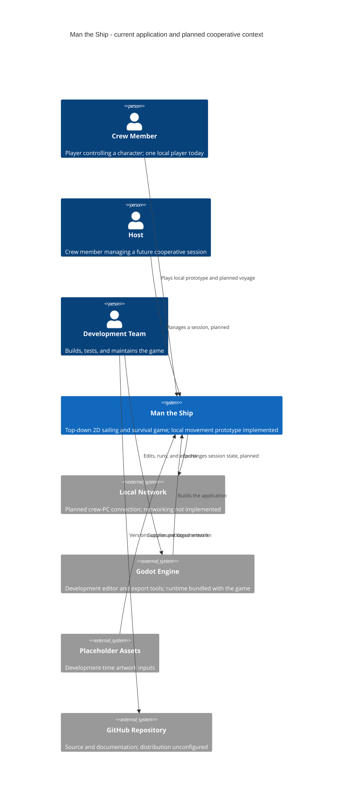
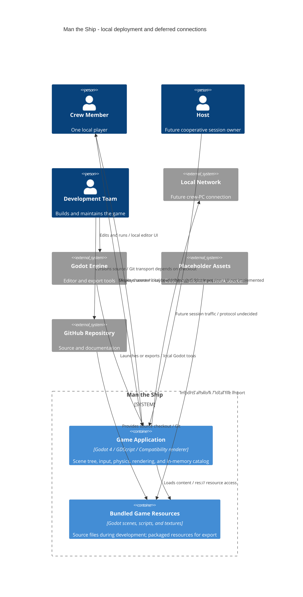
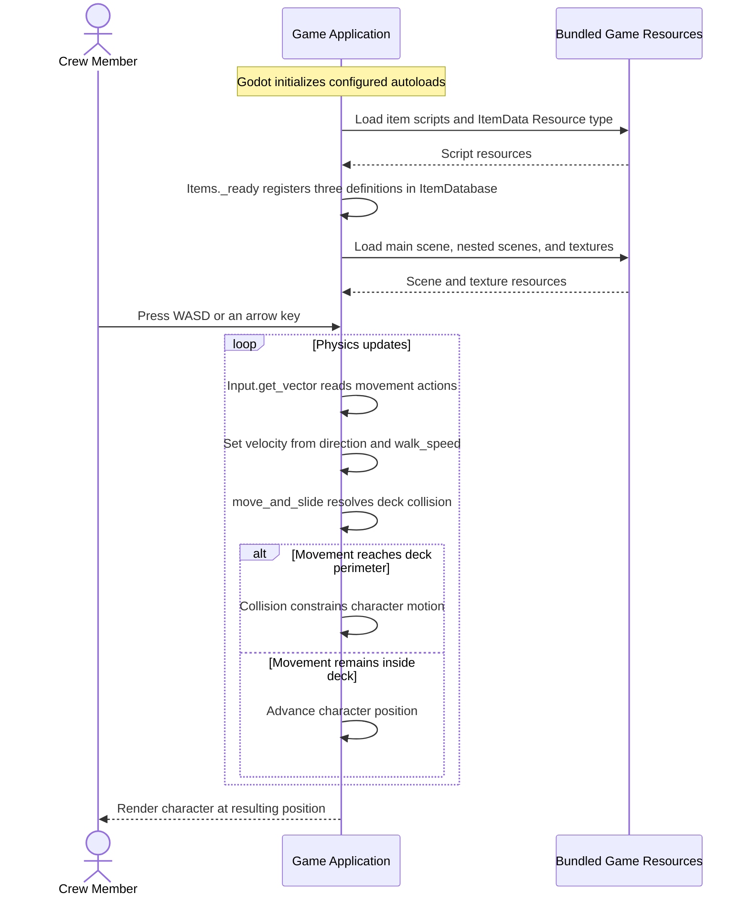

# Architectural Design

**Project:** Man the Ship

**Team:** Team 13 (Gaming) — Whitney Akred, Shana Billiot, Liliana Matte, Gustavo Castillo, Leiton Peterson, Ivan Lopez

**Client:** Student-led project; the development team serves as the client

**Version:** 0.2

**Architecture baseline:** Architectural documentation branch, October 2, 2026

This document describes the system's boundaries, responsibilities, and architectural decisions. It distinguishes the **implemented prototype** from the **planned architecture** and covers all six use case areas without committing all of them to the next milestone.

The implementation contains one stationary ship, one controllable character, deck collision, a fixed camera, and an in-memory item definition catalog. Sailing, interactive stations, survival, procedural travel, islands, trading, saving, and networking are not implemented. The catalog was added after the movement-only description in [Minimal MVP](../minimal-mvp.md).

### Sources and interpretation

Runtime claims are grounded in [project.godot](../../project.godot), [scenes](../../scenes/), and [scripts](../../scripts/). Development constraints come from [AGENTS.md](../../AGENTS.md). Product intent comes from the [use cases](../requirements/use-cases.md), [project glossary](../requirements/project-glossary.md), [vision and scope](../requirements/vision-and-scope.md), and recorded answers in the [client interview](../requirements/client-interview-guide.md).

The software requirements specification is still a template: its example quality, security, interface, and constraint identifiers are not Man the Ship requirements. This document cites actual sources rather than inventing requirement handles or performance targets. Missing requirements and conflicting older statements are recorded in section 11.2. Proposed conventions and decisions are labeled and do not claim prior team approval.

## Identifiers

| Space | Purpose | Example |
|---|---|---|
| `KD-<slug>` | Key architectural decisions | `KD-deployment-shape` |
| `QS-<slug>` | Quality scenarios | `QS-deck-boundary` |
| `RISK-<slug>` | Technical risks | `RISK-moving-deck` |
| `TD-<slug>` | Known technical debt | `TD-item-validation` |

Identifiers from other documents retain their original names. Only `UC-NAV-steer-ship` has a full use case specification; unnamed backlog entries are referenced by area rather than assigned new identifiers here.

## Revision History

| Version | Date | Author | Change |
|---|---|---|---|
| 0.1 | Not recorded in original draft | Original contributors | Architecture template and section 5.1 diagram |
| 0.2 | 2026-10-02 | AI-assisted draft for Team 13 review | Complete architectural sections from repository evidence, preserve the original diagram, and distinguish implementation from plans and unresolved requirements |

## 1. Introduction and Goals

### 1.1 Requirements overview

See the [software requirements specification](../requirements/software-requirements-specification.md) and [use cases](../requirements/use-cases.md).

### 1.2 Quality goals

This priority order is proposed from the single-player-first direction and project instructions. It is not a client-approved ranking or a substitute for measurable requirements in specification section 9.

| Priority | Quality goal | Existing source | Why it shapes the architecture |
|---|---|---|---|
| 1 | Reliable, understandable local gameplay | `FEAT-single-player-survival`; `UC-NAV-steer-ship`; AGENTS.md | Movement and shared-ship interactions need to work consistently before multiplayer makes failures harder to diagnose. |
| 2 | Maintainable separation of crew responsibilities | AGENTS.md; use case areas; team contract section 4 | Reusable scenes and station-oriented components let teammates develop different responsibilities without putting every mechanic in the player script. |
| 3 | Sustainable travel and compatible rendering | AGENTS.md; project.godot | Indefinite horizontal travel needs bounded active world content, while Compatibility rendering and Web compatibility constrain rendering choices. |

### 1.3 Stakeholders

See [vision and scope, section 3.1](../requirements/vision-and-scope.md#31-stakeholder-profiles); the [client interview, section 1](../requirements/client-interview-guide.md#1-get-to-know-your-client) confirms that the team itself is the client.

## 2. Architecture Constraints

No project-specific `CO-*` or `OE-*` requirements have been established in specification sections 2.3–2.4. These existing sources govern the architecture until those sections are completed.

| Source | Constraint and architectural consequence |
|---|---|
| AGENTS.md | Use Godot 4 and GDScript, retaining the Compatibility renderer and HTML5/Web compatibility; C# is outside the project's direction. |
| AGENTS.md; client interview sections 2 and 9 | Develop the local boat/station loop before networking; eventual four-player support influences ownership boundaries, not the current deployment count. |
| AGENTS.md | Build indefinite travel with deterministic/recycled ocean chunks rather than one enormous water mesh. |
| AGENTS.md | Favor reusable scenes, signals, typed GDScript, Inspector-configurable properties, and replaceable placeholder artwork. |
| AGENTS.md; `OI-1`, `OI-2` | Preserve a narrow playable milestone; the backlog does not authorize large inventory, crafting, or progression systems. |
| Vision and scope sections 3.2 and 4.4 | PC is the initial target; operating systems, hardware limits, distribution, and long-term maintenance remain unresolved. Web compatibility is a constraint, not evidence of a published browser build. |

The project configuration declares Godot 4.7 features, and the MVP guide names Godot 4.7.2. These are repository settings, not an independently established platform support matrix.

## 3. Context and Scope

The game is a self-contained local application today. Crew Member and Host are the actor names in the use cases; Host's session-management capabilities belong to later cooperative play. Development Team builds the application rather than representing a privileged in-game account.

This view retains the ecosystem in the original section 5.1 diagram while labeling development and future dependencies. Local Network is a transport environment, not a selected matchmaking or authentication service. Godot's runtime is inside the game; editor/export tools, asset sources, and GitHub are development dependencies. No runtime calls to external services appear in the code, consistent with client interview section 10.

The original drawing mentions itch.io packs and GitHub player downloads. Those labels express the intended workflow: the checkout does not establish artwork provenance or contain a release pipeline. These are verification items in section 11.2. No store, account provider, analytics service, cloud database, or dedicated multiplayer server has been selected.

## 4. Solution Strategy

- Run the local prototype as one Godot application with bundled resources and in-memory state (`KD-deployment-shape`), keeping initial gameplay independent of backend services.
- Divide gameplay into reusable scenes and components organized by use case area, separating stations from character movement (`KD-station-components`; section 5.2).
- Establish local gameplay and ownership rules before cooperative transport (`KD-local-first`), using `UC-NAV-steer-ship` as the next specified station interaction.
- Generate or recycle nearby ocean chunks deterministically when travel is implemented, retaining Compatibility rendering (`KD-world-chunks`).
- Keep the item catalog distinct from inventories and saved progress; add persistence after its requirements are established (`KD-deployment-shape`; section 8.2.8).

## 5. Building Block View

### 5.1 Containers

The original team diagram is retained below. It shows the wider development and planned play environment; the container view that follows makes the execution boundary explicit.

There is one running application; Bundled Game Resources is a storage boundary shipped with it, not another process (`KD-deployment-shape`). Player, ship, stations, and item services are internal components. `ItemDatabase` is an autoloaded in-memory dictionary, not a database deployment or durable player storage.

### 5.2 Use case areas and components

The area list comes from use cases section 3; no traceability.md exists in this checkout. **Provisional** means a component has not completed an end-to-end specified use case. Existing code is identified separately rather than presented as proof of sailing or inventory behavior.

| Use case area | Component | Responsibility | Depends on | Status |
|---|---|---|---|---|
| `NAV` | Navigation and Sailing | Owns heading, propulsion, wind effects, and navigation actions in the steering case and backlog. | Ship State, Station Interaction, World and Ocean, Crew Control | Provisional; no sailing code |
| `SHIP` | Ship Systems and Maintenance | Owns hull condition, repairs, rescue, and floating-chest handling when specified. | Ship State, Station Interaction, Crew Control, Item Catalog, World and Ocean | Provisional; ship supplies only art/collision |
| `SURV` | Crew Survival | Owns hunger, thirst, stamina, recovery, and kitchen actions per crew member. | Crew Control, Station Interaction, Item Catalog | Provisional; not implemented |
| `ISLE` | Island Exploration | Owns landing/exploration, treasure interactions, and visited-island state. | World and Ocean, Crew Control, Item Catalog | Provisional; not implemented |
| `TRADE` | Trading and NPC Encounters | Owns proposed encounters and exchanges, including currency if approved. | World and Ocean, Crew Control, Item Catalog | Provisional; not fully specified |
| `LOBBY` | Session Setup | Owns session creation, membership, customization, and readiness for cooperative play. | Crew Control; Local Network through a future adapter | Provisional; launch enters the scene directly |
| Cross-cutting | Crew Control | Owns movement and routes crew intent to the relevant gameplay owner. | Godot input/physics; Station Interaction when implemented | Provisional overall; deck movement exists |
| Cross-cutting | Ship State | Owns shared vessel transform/state so stations do not keep conflicting copies. | Godot scene tree and physics | Provisional; stationary ship exists |
| Cross-cutting | Station Interaction | Owns range checks, exclusive occupancy, and release of station control. | Crew identity/position supplied by callers | Provisional; no interactive stations |
| Cross-cutting | World and Ocean | Owns active chunks, deterministic placement, and spatial information. | Godot scene tree and bundled resources | Provisional; blue background only |
| Cross-cutting | Item Catalog | Owns reusable item definitions and lookup by stable identifier. | Bundled Game Resources | Provisional as gameplay integration; registration exists |

Dependencies describe intended boundaries, not implemented call chains. Stations manage occupancy and forward intent; the relevant area changes its own state. Mutable inventories must be separate from shared definitions. Backlog areas do not require separate services.

Godot tools, Placeholder Assets, and GitHub support all areas through section 5.1's build/content workflow; they are not gameplay components. Local Network belongs to the deferred Session Setup/transport boundary.

### 5.3 Current implementation map

| File | Implemented responsibility |
|---|---|
| [project.godot](../../project.godot) | Main scene, input, viewport, renderer, and ItemDatabase/Items autoloads. |
| [main.tscn](../../scenes/main.tscn) | Ship instance and fixed Camera2D. |
| [ship.tscn](../../scenes/ship.tscn) | Ship art, perimeter collision, and player instance. |
| [player.tscn](../../scenes/player.tscn), [player.gd](../../scripts/player.gd) | Character sprite/collider, exported speed, and physics-frame movement. |
| [item_data.gd](../../scripts/item-system/item_data.gd) | ItemData Resource with exported descriptive fields. |
| [item_database.gd](../../scripts/item-system/item_database.gd) | Typed in-memory catalog, lookup, and ID assertions. |
| [items.gd](../../scripts/item-system/items.gd) | Registers Cod, Rope, and Fishing Rod; does not grant player inventory. |

## 6. Runtime View

The implemented slice is deck movement, a prerequisite for approaching the helm in `UC-NAV-steer-ship`, not completed steering. Participants use the container names from section 5.1; internal calls identify behavior without treating nodes as processes.

The catalog initializes independently; the player script never queries it. No external service, network exchange, save transaction, helm claim, or ship movement occurs. Invalid built-in registration triggers an assertion in debug builds; missing lookup returns null. User-facing recovery for resource/data failures is not implemented.

Once steering exists, its runtime view must show acquisition/denial, heading/speed changes, release, and applicable use case extensions. Synchronization must be documented against an actual transport and authority model.

## 7. Deployment View

### 7.1 Container placement

| Container or dependency | Development | Player release |
|---|---|---|
| Game Application | Local Godot editor/command-line execution. | Planned local export; production unconfigured. |
| Bundled Game Resources | Files under res:// in the checkout plus import caches. | Packaged with game; exact packaging unselected. |
| Godot Engine tools | Installed for editing, import, execution, and export. | Editor unnecessary; runtime accompanies export. |
| GitHub Repository | Shared source/docs under team review workflow. | Diagram's download channel unconfigured. |
| Placeholder Assets | Committed art and import metadata. | Included subject to verified permissions. |
| Local Network | Unused by current code. | Cooperative transport deferred. |

This follows [vision and scope section 4.4](../requirements/vision-and-scope.md#44-deployment-considerations). No production server, supported OS matrix, or browser hosting provider is established.

### 7.2 Delivery workflow

The [team contract, section 5](../team-contract.md#5-git-workflow-and-review) requires feature branches and two independent approvals before merging into main. No CI workflow, export preset, automated suite, or publishing configuration exists. A merge updates source, not a published build.

To run source, open project.godot in Godot and select **Run Project (F5)**. The proposed release workflow is to import/validate the merged revision, check gameplay, configure a target under **Project > Export**, build with **Export Project**, and test that artifact before distribution. This is a proposed manual workflow, not an existing pipeline. Web compatibility still requires exported-build validation.

### 7.3 Restart behavior

Scenes, scripts, artwork, configuration, and built-in definitions survive restart as application content. Character position/runtime state are recreated; definitions are re-registered in memory. There is no saved voyage, inventory, profile, or transaction to restore. The generated .godot cache is development data, not player progress.

## 8. Crosscutting Concepts

### 8.1 Security

**Trust boundary.** Game Application owns the local simulation; keyboard input enters through Godot Input. No application endpoints are exposed today. Future traffic from other PCs crosses a separate trust boundary and must be treated as untrusted, with gameplay requests validated by the session authority. Neither transport nor session admission is selected, so authenticated LAN traffic is not an implemented property.

**Authentication.** The prototype has no accounts, credentials, or sign-in. Crew Member and Host are gameplay actors rather than identity-provider roles. Before networking, define how a peer joins and how a connection maps to crew identity; an account service is not implied by the current scope.

**Authorization.** Future Station Interaction owns occupancy checks from `UC-NAV-steer-ship`; local presentation must not grant authority to take another crew member's station. Session Setup owns Host-only operations when implemented. The referenced `BR-single-helmsman` is absent from business-rules.md, so the steering use case supplies the current behavioral source.

**Sensitive data.** The gameplay code neither collects nor persists personal data or account information. Team names in documents are not runtime player records. Specification section 7.4 has no project retention policy; define one if player identifiers, telemetry, or profiles are introduced. No runtime secrets are required today; future publishing credentials belong in the release environment's secret storage. Project-specific `SEC-*` requirements are still missing, not replaced by template web-application examples.

### 8.2 Other concepts

These rules combine existing conventions with labeled proposals for unbuilt systems. Examples name real files only where the behavior exists.

#### 8.2.1 Error handling

Proposed rule: reject invalid actions at the state-owning component and return a result the UI can explain without partially applying an action. Occupied-wheel denial in the steering use case motivates this rule. Currently item_database.gd asserts on invalid built-in IDs and returns null for unknown lookups; this is not a complete runtime recovery strategy.

#### 8.2.2 Time and time zones

Use simulation time for movement and future gameplay durations, keeping wall-clock time out of steering/survival rules. player.gd sets velocity in _physics_process; move_and_slide handles physics-step movement. Proposed timers should use elapsed simulation time for reproducibility. There are no civil-time deadlines or stored time zones; pause and multiplayer timing rules remain unspecified.

#### 8.2.3 API conventions

Keep gameplay interfaces inside Godot through typed methods, Resources, and signals; no HTTP or JSON API exists. ItemDatabase.register_item and get_item are local examples. Proposed station interfaces accept crew identity and intent while leaving mutation to state owners; a later adapter can translate network requests into those operations.

#### 8.2.4 Code conventions

Follow AGENTS.md: GDScript, reusable scenes, typed values, signals for decoupled notifications, and Inspector-exposed settings. player.gd demonstrates an exported speed and typed callback; ItemData demonstrates a Resource. Keep artwork replaceable without rewriting gameplay. A project-wide signal pattern has not yet been implemented.

#### 8.2.5 Validation

Proposed rule: the state owner performs decisive range, ownership, and value checks; a visual prompt alone never grants control. ItemDatabase currently asserts nonempty/unique IDs, but does not validate all fields or provide release-safe rejection. Consumers must handle unknown IDs and distinguish definitions from owned quantities.

#### 8.2.6 Configuration and secrets

Keep input/render/application settings in project.godot and gameplay tuning in exported properties or Resources, as shown by walk_speed and ItemData. No service configuration exists. Future export presets should express packaging, with credentials outside source control. Current speed and viewport values are settings, not requirement thresholds.

#### 8.2.7 Logging

Proposed rule: log actionable initialization/validation failures and state transitions, avoiding per-frame movement noise and future credentials/personal data. No structured logging subsystem exists; item-registration assertions are the explicit diagnostics in current gameplay scripts. Future network diagnostics should distinguish disconnects from invalid actions.

#### 8.2.8 Persistence and concurrency

Runtime state lives in one local process; the catalog is reconstructed at launch. Proposed ownership assigns each shared mutation to one component, including a station claim as one check-and-claim operation. There are no database transactions or saves. Save format, crash recovery, session authority, and disconnect synchronization require decisions before their respective features are implemented.

#### 8.2.9 Auditing

Git history and reviews record development changes. No runtime account, financial, or regulated operations require an audit trail in the documented scope. Proposed multiplayer debugging may log ownership transitions locally; this is diagnostic output rather than a selected persistent audit service. Revisit retention if identifiable player events are stored.

#### 8.2.10 Testing

Use Godot command-line import/parser and startup checks when available, followed by focused gameplay checks, as directed in AGENTS.md. Minimal MVP describes launch, movement, and deck collision checks. There is no committed automated suite. Future checks should exercise station contention/release, sailing, deterministic recycling, and actual desktop/Web exports; headless checks cannot establish visual or input usability.

## 9. Architectural Decisions

### 9.1 Architecturally significant requirements

The ranking is provisional and based on project evidence, not a quantified client assessment. Actual sources replace specification handles that have not yet been established.

| Rank | Driver | Source | Importance and difficulty | Drives |
|---|---|---|---|---|
| 1 | Consistent local movement and station loop | AGENTS.md; `UC-NAV-steer-ship`; `FEAT-single-player-survival` | Core behavior; moving-deck integration unproven | `KD-deployment-shape`, `KD-local-first` |
| 2 | Modular crew responsibilities | AGENTS.md; team contract section 4 | Affects all future areas; establish boundaries before networking | `KD-station-components` |
| 3 | Bounded content during indefinite travel | AGENTS.md | Architectural constraint; performance budget and state retention unresolved | `KD-world-chunks` |
| 4 | Compatibility rendering and Web compatibility | AGENTS.md; project.godot | Needs validation on actual exports | `KD-deployment-shape`, `KD-world-chunks` |
| 5 | Ownership validation at the future peer boundary | `UC-NAV-steer-ship`; `FEAT-cooperative-play` | Security-relevant before cooperative release; project security handle missing | `KD-local-first`; section 8.1 |

### 9.2 Key decisions

#### KD-deployment-shape: One local application with bundled content

**Status:** Implemented baseline; distribution packaging remains open.

- **Drivers:** Existing code, single-player-first direction, and no external runtime dependencies in client interview section 10.
- **Context:** The prototype needs local input, physics, rendering, and definitions; no backend or persistent player data exists.
- **Decision:** Keep gameplay in one Godot process, loading bundled content through res://. ItemDatabase remains an internal catalog.
- **Alternative not adopted:** Separate gameplay services or a remote inventory database add deployment/connectivity dependencies without a specified need. Database discussion in napkin-round-0.md is an early brainstorm, not an implemented dependency.
- **Trade-off:** Gameplay shares one process and its failures; progress does not survive restart without a future save design.

#### KD-local-first: Defer networking until the local boat/station loop is stable

**Status:** Required by AGENTS.md and consistent with the recorded single-player-first direction.

- **Drivers:** AGENTS.md; `FEAT-cooperative-play`; `UC-NAV-steer-ship`.
- **Context:** Four-player cooperation is the architecture target, but even local steering is not implemented.
- **Decision:** Establish explicit local state ownership before adding session transport.
- **Alternative not adopted:** Adding synchronization to the initial prototype couples gameplay debugging to connection and replication problems prematurely.
- **Trade-off:** Current play remains single-player; authority, latency, and disconnect handling still require later work. LAN appears in the original diagram, but no protocol or networking API is selected here.

#### KD-station-components: Separate character control, stations, and ship state

**Status:** Required direction in AGENTS.md; detailed boundaries proposed here, not implemented.

- **Drivers:** Station-oriented systems in AGENTS.md and exclusive wheel control in `UC-NAV-steer-ship`.
- **Context:** Movement lives in player.gd while the ship contains only visuals and collision.
- **Decision:** Preserve character movement as a separate responsibility; stations manage participation and send intent to ship/survival state owners.
- **Alternative not adopted:** One player script for steering, repairs, survival, and inventory would couple unrelated features and complicate multiple crew members.
- **Trade-off:** Components need explicit references/signals and lifecycle handling. Class and interface details belong in later use-case designs grounded in code.

#### KD-world-chunks: Deterministic, recycled ocean content

**Status:** Required direction in AGENTS.md; not implemented.

- **Drivers:** Indefinite horizontal travel and lightweight Web-compatible rendering.
- **Context:** The ocean is currently a background color, not a world or water mesh.
- **Decision:** Generate/reuse nearby chunks from stable world coordinates and deterministic generation inputs, keeping an active neighborhood instantiated.
- **Alternative not adopted:** One enormous mesh or keeping all visited chunks allocated ties resource use to distance traveled.
- **Trade-off:** Seams, revisits, coordinate precision, and modified locations require further design. Deterministic layout alone does not preserve collected loot or changed island state.

## 10. Quality Requirements

### 10.1 Quality requirements overview

See [software requirements specification, section 9](../requirements/software-requirements-specification.md#9-quality-attributes); project-specific quality requirements remain to be established.

### 10.2 Quality scenarios

These scenarios define observable checks without inventing frame-rate, timing, availability, or retention commitments. Proposed checks remain unverified until components and tests exist.

| ID | Source and stimulus | Environment | Response | Measure and source | Verification method / status |
|---|---|---|---|---|---|
| `QS-deck-boundary` | Player holds movement toward a deck edge. | Current prototype | Collision constrains motion. | No crossing the perimeter; Minimal MVP and ship.tscn. | Manual: Run Project (F5), move against edges/corners with WASD/arrows; visual check required. |
| `QS-station-ownership` | Another crew member claims an occupied helm. | Future local test with two crew identities | Preserve owner and deny new claim with feedback. | Extension 2a of `UC-NAV-steer-ship`. | Proposed component/integration check; not implemented. |
| `QS-station-release` | Helmsman releases or leaves permitted range. | Future local steering | Wheel becomes unclaimed. | Main flow and extension 6a of steering use case; range unspecified. | Proposed lifecycle check; disconnect branch waits for networking. |
| `QS-station-isolation` | Developer adds a station responsibility. | Future station architecture | Existing movement and stations remain intact. | Separation required by AGENTS.md; inspect dependencies and regressions. | Proposed review/regression check; not implemented. |
| `QS-world-recycling` | Ship crosses chunks and revisits coordinates. | Future procedural world | Recycle distant chunks and reproduce unchanged layout. | Bounded active set and deterministic layout per AGENTS.md; numeric budget absent. | Proposed seeded travel check with node/memory observations. |
| `QS-compatible-export` | Player launches an exported build. | Selected PC and future Web targets | Scene, movement, and collision work. | Prototype behavior and Compatibility/Web direction in AGENTS.md. | Proposed export smoke check; presets/support matrix absent. |

## 11. Risks and Technical Debt

### 11.1 Technical risks and known debt

| ID | Type | Failure mechanism and consequence | Mitigation or fix | Source |
|---|---|---|---|---|
| `RISK-moving-deck` | Risk | Translating/rotating the ship may create drift, jitter, or incorrect collision because the existing deck is stationary. | Prove moving-deck behavior locally before additional stations or networking. | ship.tscn; player.gd; steering use case |
| `RISK-peer-authority` | Risk | Peers accepting independent claims or updates could create conflicting state or permit invalid actions. | Select session authority and validate ownership before cooperative implementation. | `OI-coop`; steering extension 2a |
| `RISK-world-growth` | Risk | Retained visited nodes or excessive generation could grow memory use or stall play. | Recycle chunks, profile crossings, and define modified-state retention. | AGENTS.md; `OI-scale` |
| `RISK-travel-precision` | Risk | Large coordinates could reduce precision and disrupt collision or seams. | Evaluate rebasing/chunk-relative positions when implementing travel; test distant coordinates. | AGENTS.md indefinite-travel constraint |
| `RISK-export-gap` | Risk | Editor-only testing could miss incompatible resources, input, or performance on exports. | Establish targets and test actual artifacts. | Vision and scope section 4.4; AGENTS.md |
| `TD-item-validation` | Debt | Registration relies on debug assertions and does not reject invalid stack limits; unknown IDs return null. | Add release-safe validation and missing-item handling when gameplay consumes the catalog. | item_database.gd; item_data.gd |
| `TD-placeholder-ocean` | Debt | Clear-color water has no world, hazards, or travel behavior. | Replace the shortcut with chunked content during navigation work. | project.godot; `KD-world-chunks` |
| `TD-manual-verification` | Debt | No committed tests or pipeline means regressions can escape informal checks. | Add focused checks as slices arrive and automate validation when targets are chosen. | Repository tree; section 7.2 |

Saving, survival, and networking are unimplemented features, not automatically technical debt; their absence fits the narrow milestone.

### 11.2 Source gaps and decisions still required

These findings mark evidence limits and decisions needed before affected release commitments. The development team owns them; existing issue identifiers refer to [OPEN-ISSUES.md](../requirements/OPEN-ISSUES.md).

| Gap or inconsistency | Architectural impact | Existing home / next action |
|---|---|---|
| Specification contains generic examples rather than project constraints, interfaces, security requirements, and quality targets. | Formal requirement traceability cannot yet be completed honestly. | Complete specification sections 2, 7, 8, and 9 from team decisions; `OI-testing` covers playtests. |
| Most listed use cases are unnamed and unspecified. | A component home does not imply approved delivery scope. | `OI-1`, `OI-2`; specify selected cases before implementation. |
| Steering cites undefined `BR-single-helmsman`; collision and tuning are open. | Rule traceability and numeric acceptance checks are incomplete. | Resolve steering Open Issues and file its rule in the proper requirements home. |
| Older glossary/vision text leaves crew count undecided, while AGENTS.md/use cases specify eventual four-player support. | This document uses four-player readiness, without claiming shipped multiplayer. | Reconcile older documents under `OI-scale` and `OI-coop`. |
| Original diagram names LAN and GitHub downloads; no transport, export preset, or publishing workflow exists. | Joining, protocols, disconnects, targets, and distribution remain undecided. | `OI-coop`; vision and scope section 4.4. |
| Diagram labels assets as itch.io packs; current PNGs have no provenance/license record in the checkout. | Redistribution permissions and attribution cannot be verified. | Record origins/permissions before publishing an export. |
| Saving and modified-world retention are unspecified. | Deterministic generation cannot identify collected loot; durability could change storage design. | Vision and scope section 4.4; settle before saved voyages. |
| Post-course support and ownership remain unresolved. | Release/maintenance tools lack a confirmed long-term operator. | `OI-maintenance`; vision and scope section 4.4. |
| Minimal MVP calls player.gd the only gameplay script, but item scripts/autoloads now exist. | Using the guide alone omits a subsystem. | Section 5.3 records current code; update the guide when documenting the item feature. |

## 12. Glossary

Domain vocabulary lives in the [project glossary](../requirements/project-glossary.md). These terms clarify architectural usage:

| Term | Meaning here |
|---|---|
| Container | A running application or separately described storage boundary in C4; not a Docker container. |
| Component | An internal responsibility within Game Application, not a separately deployed service. |
| Autoload | A Godot node loaded at startup and accessible across scenes; used by ItemDatabase and Items. |
| Item Catalog | In-memory definitions shared by item ID, distinct from inventory/ownership and durable storage. |
| Station ownership | The crew member permitted to operate an exclusive station, distinct from code ownership. |
| Chunk | A bounded world portion generated, loaded, or recycled independently. |
| Provisional | A responsibility not yet exercised through a complete specified use case. |
| Session authority | The future simulation owner deciding valid shared-state changes; networking implementation unselected. |
