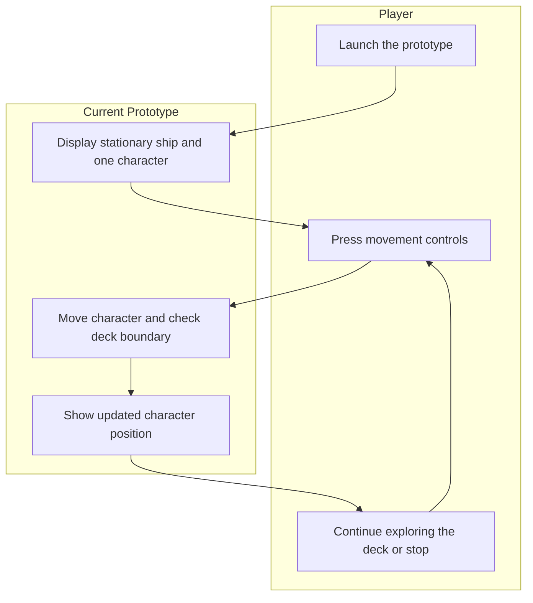
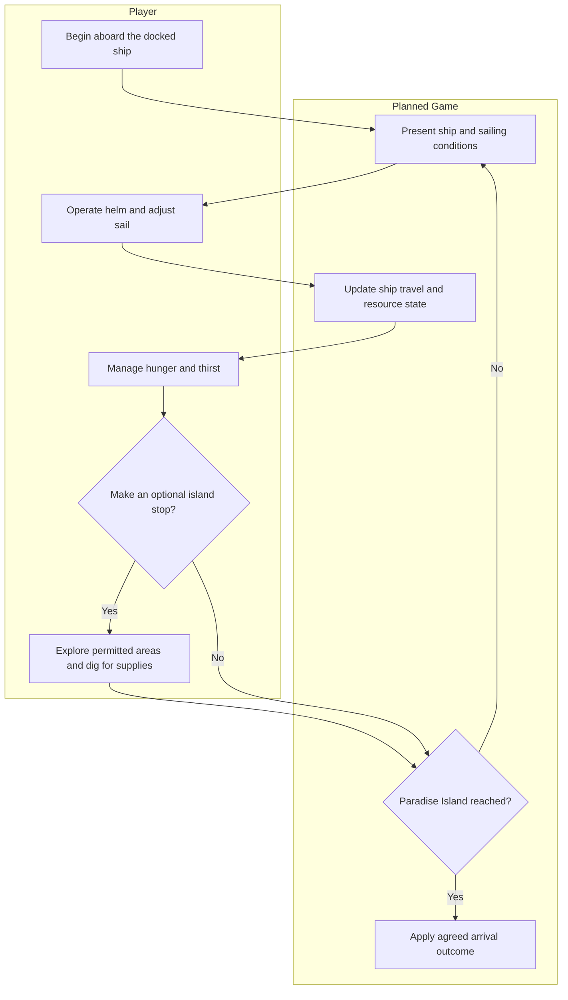
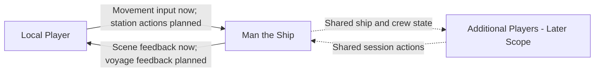

# Vision and Scope

**Project:** Man the Ship  
**Team:** Team 13 (Gaming) — Whitney Akred, Shana Billiot, Liliana Matte, Leiton Peterson, Ivan Lopez, Gustavo Castillo  
**Client:** None — student-led TCU Senior Design project; the development team owns product decisions  
**Version:** 0.2 — Updated draft for team review  
**Reviewed:** September 25, 2026

This document distinguishes the documented current prototype, the planned game, and ideas that still require a team decision. The current minimal MVP is a stationary ship with one character walking around its bounded deck. It is not yet a complete survival game.

This revision uses the repository's minimal-MVP guide and glossary for current scope, the use cases for specified player behavior, and the team contract for decision ownership. Earlier meeting records provide background. Instructions and worked examples in unfinished templates are not project requirements. Where documents disagree, this draft records the conflict rather than assuming approval.

## Revision History

| Date | Version | Description | Author |
|---|---|---|---|
| 2026-09-11 | 0.1 | Initial draft based on September 10 meeting notes | Original author/reviewer not recorded |
| 2026-09-25 | 0.2 | Align name, student ownership, current prototype, planned game loop, feature status, and unresolved decisions with repository documentation | AI-assisted revision requested by Gustavo Castillo; pending team review |

## 1. Introduction

Man the Ship is a top-down 2D sailing and survival game for PC. Its intended experience centers on a shared ship: crew members operate stations, manage supplies, and travel toward Paradise Island, with optional island stops for treasure and resources. Development begins locally with one player; cooperative play is a later goal.

This document defines the product's purpose, intended benefits, stakeholders, and boundaries. It does not make every brainstormed feature a release commitment.

### 1.1 Background

Team 13 consists of six TCU Senior Design students who collectively define, develop, and evaluate the game. There is no external client to identify or obtain requirements from. Intended players provide feedback, and course instructors evaluate the project.

The September 10 meeting established the ship-survival concept, PC target, and single-player-first direction. Subsequent documentation identifies Godot, a top-down 2D presentation, and a planned loop of sailing, hunger/thirst management, and optional island visits.

The minimal-MVP guide documents a playable starting point with a stationary ship and deck movement. It explicitly excludes sailing, interactive stations, survival, swimming, procedural ocean, a heads-up display, and networking. The current art is static; painted ship controls are not interactive stations. This is documented status, not a new runtime verification performed for this revision.

### 1.2 Current Process Flows (As-Is Process Flows)

The current player experience is a movement prototype rather than a replacement for an existing business process.

The player moves around the deck using WASD or arrow keys. The boundary keeps the character aboard, while the ship and camera remain stationary. There is no departure, sailing challenge, resource management, or voyage outcome to evaluate yet.

| Current tool or artifact | Purpose | Current limitation |
|---|---|---|
| Godot prototype and minimal-MVP guide | Establish scene structure, movement, and deck collision | Cannot yet demonstrate the intended sailing-survival loop |
| Repository requirements documents | Record scope, terms, use cases, and open questions | The specification and business-rules files still contain template material |
| Use-case document | Describe player goals and steering behavior | Only `UC-NAV-steer-ship` is fully written; other entries are a scaffold |
| Glossary | Define intended gameplay and distinguish planned features from current behavior | Some design decisions remain open or disagree with older documents |
| Shared meeting records and design boards | Record discussion and feature ideas | Board contents are represented here through the glossary and use cases; the board itself was not supplied in this folder |
| Team contract | Define ownership, decisions, and review | Communication details differ from the interview record and need reconciliation |

The main product gap is concrete: players can walk to the wheel but cannot steer, and the current scene cannot show whether sailing and survival are enjoyable together. Documentation also needs alignment: the use cases state a four-player cap while the glossary leaves crew size unconfirmed.

Domain definitions belong in the project glossary. A **station** is a place where a crew member performs a ship task; a **voyage** is the planned journey toward Paradise Island; the **minimal MVP** is the current movement-only starting point.

### 1.3 References

Repository paths below are relative to the repository root.

| Reference | Date/version | Location |
|---|---|---|
| Minimal game starting point | Undated; reviewed 2026-09-25 | `docs/minimal-mvp.md` |
| Project glossary | Version 0.2, 2026-09-13 | `docs/requirements/project-glossary.md` |
| Use cases | Version 0.1, 2026-09-13 | `docs/requirements/use-cases.md` |
| Team contract | Signed 2026-09-04 | `docs/team-contract.md` |
| Initial interview and meeting record | Group meeting 1; records September 10 discussion | `docs/requirements/client-interview-guide.md` |
| Open issues | Entries raised 2026-09-13 | `docs/requirements/OPEN-ISSUES.md` |
| Software requirements specification | Version 0.1; template not completed | `docs/requirements/software-requirements-specification.md` |
| Business rules | Version 0.1; template not completed | `docs/requirements/business-rules.md` |
| Rough project assessment | Undated | `docs/napkin-round-0.md` |
| Project development constraints | Undated | `AGENTS.md` |
| Original vision-and-scope template | Previously supplied | https://github.com/tcu-cosc-40943/course-templates |
| Research candidates | Comparative findings not recorded | Don't Sleep With the Fishes; Raft, identified in the interview record |

## 2. Business Requirements

For this student-led project, business requirements describe intended player value and outcomes the development team can evaluate. No revenue or market-share objective has been established.

### 2.1 Business Opportunity or Problem Statement

Man the Ship explores whether moving between ship duties, responding to wind, and managing supplies can create an engaging survival journey. Optional island visits are intended to offer choices about collecting resources before continuing toward Paradise Island.

The immediate opportunity is to extend the movement prototype into a coherent local sailing experience and test its appeal. The larger cooperative vision adds shared responsibilities, but networking should not begin before the local boat-and-station loop is stable. The team's earlier single-player-first agreement remains relevant; the exact readiness gate for multiplayer is still undefined.

Player demand and differentiation from existing games have not been validated. The current prototype alone cannot establish those claims.

### 2.2 Business Objectives

The existing objectives and identifiers are retained. Their numerical targets are proposals from the earlier draft, not approved team commitments.

- **BO-independent-play:** Proposed target: at least 80% of first-time playtesters complete one agreed survival cycle without direct developer assistance.
- **BO-player-engagement:** Proposed target: at least 70% of playtesters say they would voluntarily play another session.

The planned cycle combines sailing toward Paradise Island, managing hunger and thirst, and optional island stops. The team must define the smaller cycle used for acceptance testing and decide when these objectives become applicable. Neither objective can be evaluated using deck movement alone.

### 2.3 Success Metrics

| Metric | Objective | Indicator and source | Baseline | Target and deadline status |
|---|---|---|---|---|
| **SM-independent-completion** | BO-independent-play | Observed proportion of first-time testers completing the agreed survival cycle without developer help | Not measured | Earlier proposed threshold: 80%; final MVP playtest date and scope require approval |
| **SM-repeat-interest** | BO-player-engagement | Proportion answering yes to whether they would voluntarily play another session | Not measured | Earlier proposed threshold: 70%; evaluation date requires approval |

The team must approve sample size, participant selection, standard instructions, measurement dates, and thresholds. Record actual baselines at the first relevant playtest. No existing measurement is inferred from the presence of a prototype.

### 2.4 Vision Statement

| Element | Statement |
|---|---|
| **For** | PC players interested in sailing, survival, and shared ship responsibilities |
| **Who** | Want to make decisions about operating a ship and obtaining supplies during a voyage |
| **The Man the Ship** | Is a top-down 2D sailing and survival game |
| **That** | Centers play on navigating a ship toward Paradise Island, managing hunger and thirst, and choosing optional island stops |
| **Unlike** | A concept expressed only through documents or disconnected mechanic demonstrations |
| **Our product** | Aims to connect physical ship duties and voyage decisions into a complete playable experience, developed locally before cooperative expansion |

This is intended positioning, not a demonstrated competitive advantage. Competitor research and player feedback must establish the latter.

### 2.5 Proposed Process Flows (To-Be Process Flows)

Compared with the current flow, sailing, supplies, island stops, and destination progression are new. Player decisions remain manual; the game updates movement and resource consequences. Dock departure, island transfer, failure conditions, restarting, and whether arrival is victory or loot extraction remain to be specified. This planned flow is not the next milestone's approved feature list.

### 2.6 Risks

Probability is unmeasured unless stated otherwise; these are mechanisms to investigate, not numerical forecasts.

| Risk | Probability | Impact | Mitigation |
|---|---|---|---|
| **RI-unclear-differentiation:** Players may find no compelling reason to choose this experience over existing survival games | Unknown pending research | High | Compare player experiences and test the appeal of ship duties |
| **RI-unengaging-survival:** Repeated supply and station tasks may feel like chores | Unknown pending playtesting | High | Evaluate a small integrated loop before expanding content |
| **RI-solo-role-overload:** Simultaneous duties designed for a crew may overwhelm one player | Unknown pending integration | High | Tune solo timing and ensure essential actions remain achievable |
| **RI-style-expectation-mismatch:** Art may imply gameplay or polish the prototype cannot deliver | Unknown | Medium | Present the prototype's status clearly and keep replacement art inexpensive |
| **RI-unvalidated-concept:** Remaining at deck movement or adding disconnected features may leave the core experience unevaluated | Present exposure; likelihood unknown | High | Prioritize an integrated local boat-and-station milestone |
| **RI-unreachable-playtesters:** Testing only with developers may hide confusing controls and assumptions | Unknown; recruitment not established | High | Recruit intended players and define repeatable playtest tasks |

### 2.7 Business Assumptions and Dependencies

| Identifier | Assumption or dependency | Consequence if false |
|---|---|---|
| **AS-target-audience** | Players interested in ship-based survival are an appropriate audience | Revise positioning and priorities |
| **AS-solo-viability** | Ship duties can produce a satisfying solo experience | Revise task demands or consider assistance after testing |
| **AS-playtester-access** | Representative players can be recruited | Understanding and engagement metrics cannot be validated as planned |
| **AS-pc-access** | Intended players have suitable PCs | Reconsider hardware targets and access plans |
| **AS-course-scope** | The eventual agreed release scope fits course requirements and available time | Replan deliverables with course evaluators |

## 3. Stakeholder Profiles and User Descriptions

### 3.1 Stakeholder Profiles

| Stakeholder | Value or benefit | Attitude | Features of interest | Constraints | End user? |
|---|---|---|---|---|---|
| Team 13 development team | Deliver and evaluate a coherent game; develop engineering skills | Supportive based on project selection | Local gameplay, maintainable features, later cooperation | Course schedule, experience, and integration effort | Also internal testers |
| Intended solo players | Enjoyable and understandable sailing-survival experience | Not assessed | Ship operation, survival, voyage decisions | Hardware, available time, genre experience | Yes |
| Intended cooperative players | Shared ship responsibilities and coordinated play | Not assessed | Shared stations and sessions | Future networking and crew-size decisions | In later scope |
| Course instructors and evaluators | Assessable software and project evidence | Not documented | Demonstrable outcomes and requirements traceability | Course milestones and evaluation criteria | Not primarily |
| External playtesters | Evaluate and influence usability and enjoyment | Recruitment not established | Clear controls and a playable loop | Availability and prior experience | During testing |

The team contract assigns routine decisions to the use-case owner and team-wide decisions to the weekly meeting, with majority decisions and ties going to the project lead. It specifies feature branches, pull requests, and two independent approvals. The project lead's identity is not established here.

### 3.2 User Environment

The current prototype supports one local player using WASD or arrow keys. The intended product is a top-down 2D PC game. Minimum hardware, supported operating systems, voyage duration, accessibility requirements, and final control bindings have not been agreed.

The repository calls for Godot 4, GDScript, the Compatibility renderer, and preservation of Web-export compatibility. The minimal-MVP guide names Godot 4.7.2 as its authoring environment; that is a repository statement, not a verified installed version or player requirement. No active Web export preset is documented, so browser delivery is not a committed release platform.

The use cases and development guidance target eventual four-player cooperation, while the glossary leaves the supported crew size unconfirmed. Treat four as a planning target pending reconciliation, not a validated capability.

### 3.3 Alternatives and Competition

| Alternative | Known strengths from available records | Weaknesses or gaps to investigate |
|---|---|---|
| Don't Sleep With the Fishes | Team-selected research reference | Comparative findings not recorded |
| Raft | Team-selected research reference | Comparative findings not recorded |
| Status quo: players continue with existing games | No need to learn or adopt this product | An unmet need for this game has not yet been established |
| Keep only the movement prototype | Provides a small environment for learning and testing movement | Cannot deliver or validate the proposed survival voyage |

## 4. Scope and Limitations

### 4.1 Product Perspective

Man the Ship is a real-time game, with inventory and supplies as potential gameplay state. The rough assessment mentions a database, but no reviewed requirement establishes a database, account service, or external integration. Those are not current scope commitments.

The ship is the primary environment. Development guidance calls for reusable station systems and eventual indefinite ocean travel through deterministic or recycled sections. The current blue background does not implement ocean travel.

### 4.2 Major Features and Scope

Existing identifiers are retained; status does not imply implementation.

| Identifier | Capability | Status |
|---|---|---|
| **FEAT-deck-movement** | Move one character around a stationary ship while remaining inside its deck boundary | Documented current minimal MVP |
| **FEAT-single-player-survival** | Manage a local ship-survival experience without other players | Product direction; survival not implemented |
| **FEAT-ship-stations** | Operate ship duties at interactive locations | Planned; only steering is fully written as a use case |
| **FEAT-sailing-control** | Steer and adjust sails in relation to wind | Planned; `UC-NAV-steer-ship` specified with unresolved tuning and collision effects |
| **FEAT-ocean-travel** | Travel beyond the starting scene through a continuing ocean | Planned; not implemented |
| **FEAT-food-water-management** | Obtain and consume food and water to manage hunger and thirst | Planned; quantities, penalties, and storage undefined |
| **FEAT-island-exploration** | Make optional island stops, walk on land, and dig for treasure or supplies | Planned; transfer, exploration extent, puzzles, and flags need specification |
| **FEAT-stamina-movement** | Support stamina-related sprinting and swimming | Planned vocabulary and scaffold; depletion, recovery, and exhaustion undecided |
| **FEAT-ship-repair** | Repair hull damage or leaks | Planned; causes, materials, and consequences undecided |
| **FEAT-floating-chests** | Encounter and collect chests at sea | Planned; contents and collection undefined |
| **FEAT-voyage-progress** | Progress toward Paradise Island | Planned; victory, failure, restart, and extraction rules unresolved |
| **FEAT-cooperative-play** | Share a ship and session among multiple players | Later scope; four-player target requires reconciliation |
| **FEAT-session-setup** | Host/join, choose appearance, and ready up | Use-case scaffold; networking deferred |
| **FEAT-trading-encounters** | Interact with pirates and traders and exchange resources or currency | Candidate scope from use-case list; not specified |
| **FEAT-ocean-encounters** | Vary voyages through random events | Open idea in glossary; event types and inclusion undecided |
| **FEAT-npc-assistance** | Receive help from game-controlled crew | Earlier meeting idea; not committed |
| **FEAT-overboard-rescue** | Help a crew member return to safety | Open idea; mechanisms and inclusion undecided |
| **FEAT-role-attributes** | Give roles distinct gameplay attributes | Earlier design option; not committed |

Fatigue/rest, bathroom mechanics, capsize meters, starvation death, and guaranteed victory on arrival appeared in earlier conversation materials. The reviewed repository does not establish them as current commitments. Stamina is not assumed to mean fatigue. Detailed future behavior must be reconciled before implementation.

### 4.3 MVP Scope

**Current minimal MVP:** FEAT-deck-movement only. It contains one stationary ship, one controllable character, a bounded deck, a fixed camera, static art, and a simple ocean background. It establishes movement and scene structure; it does not deliver the full product vision.

**Excluded from that current milestone:** FEAT-single-player-survival beyond deck movement, FEAT-ship-stations, FEAT-sailing-control, FEAT-ocean-travel, FEAT-food-water-management, FEAT-island-exploration, FEAT-stamina-movement, FEAT-ship-repair, FEAT-floating-chests, FEAT-voyage-progress, FEAT-cooperative-play, FEAT-session-setup, FEAT-trading-encounters, FEAT-ocean-encounters, FEAT-npc-assistance, FEAT-overboard-rescue, and FEAT-role-attributes.

**Next milestone:** Define and approve a narrow local boat-and-station loop. Steering is the strongest documented starting point because it has a written use case. This is a proposed sequencing recommendation, not evidence of team approval. Wind, sail control, and the steering extensions need an explicit milestone boundary.

**Later product scope:** Sailing, hunger/thirst, and optional island visits form the planned loop. Other listed capabilities remain planned or open according to Section 4.2. Networking must wait for a stable local loop; the earlier agreement to complete single-player first needs a precise acceptance gate.

No reviewed document establishes the final delivery date or final release's complete feature list. Large inventory, crafting, and progression systems are outside the narrow current direction unless the team explicitly approves them.

### 4.4 Deployment Considerations

The documented development entry point is opening the project in Godot and running the starting scene. An exported player build, supported desktop operating systems, distribution channel, and minimum hardware have not been established by the reviewed docs.

Preserve Web-export compatibility without describing a browser release as delivered: the minimal-MVP guide says the optional export preset was removed and may be added later. No hosting deployment or external service is currently required by the documented movement prototype.

Before distribution, decide how players obtain builds, learn controls, report problems, and identify versions. Save/load requirements, intended session length, future networking infrastructure, and post-course maintenance remain open. No existing user-data migration is identified.

## Review Questions and Documentation Conflicts

The following questions supplement the existing open-issues file; they do not silently resolve it or approve new scope.

| Question | Evidence or existing issue | Decision owner |
|---|---|---|
| What exactly ships after deck movement, and by when? | OI-1 and OI-2; minimal-MVP guide distinguishes current capability from plans | Development team |
| Is four the approved multiplayer cap? | Use cases and development guidance say four; glossary says unconfirmed; OI-scale | Development team |
| What does stable/completed single-player mean before networking starts? | Development guidance and meeting record use different readiness descriptions | Development team |
| What are arrival, failure, restart, and extraction rules? | Glossary leaves voyage outcomes open | Development team |
| Which steering extensions belong in the next milestone, and how are they tested? | `UC-NAV-steer-ship`: collision effects, heading bonus, and release thresholds unresolved | Steering use-case owner and team |
| Where is the single-helmsman rule defined? | Use case cites `BR-single-helmsman`; business-rules file still contains examples | Requirements owner and team |
| Which survival/movement systems are committed? | Hunger/thirst planned; stamina undefined; earlier fatigue and failure proposals not confirmed | Development team |
| Who are the target testers, and are the earlier 80%/70% proposals appropriate? | OI-users and OI-testing; no measurements supplied | Development team |
| Which operating systems and export paths are required? | PC target and Web compatibility do not establish a tested support matrix | Development team |
| Which communication record governs? | Team contract lists Slack and response windows; interview record lists Discord and different contact details | Development team |
| What visual direction and maintenance plan should be adopted? | OI-3 and OI-maintenance remain open | Development team |

The software specification and business-rules templates need project-specific content before they can serve as implementation authority. Their sample recruiting/course-administration requirements do not apply to this game.

