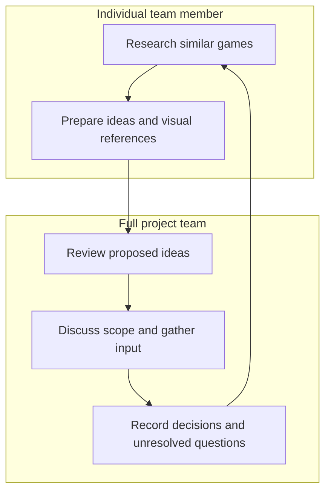
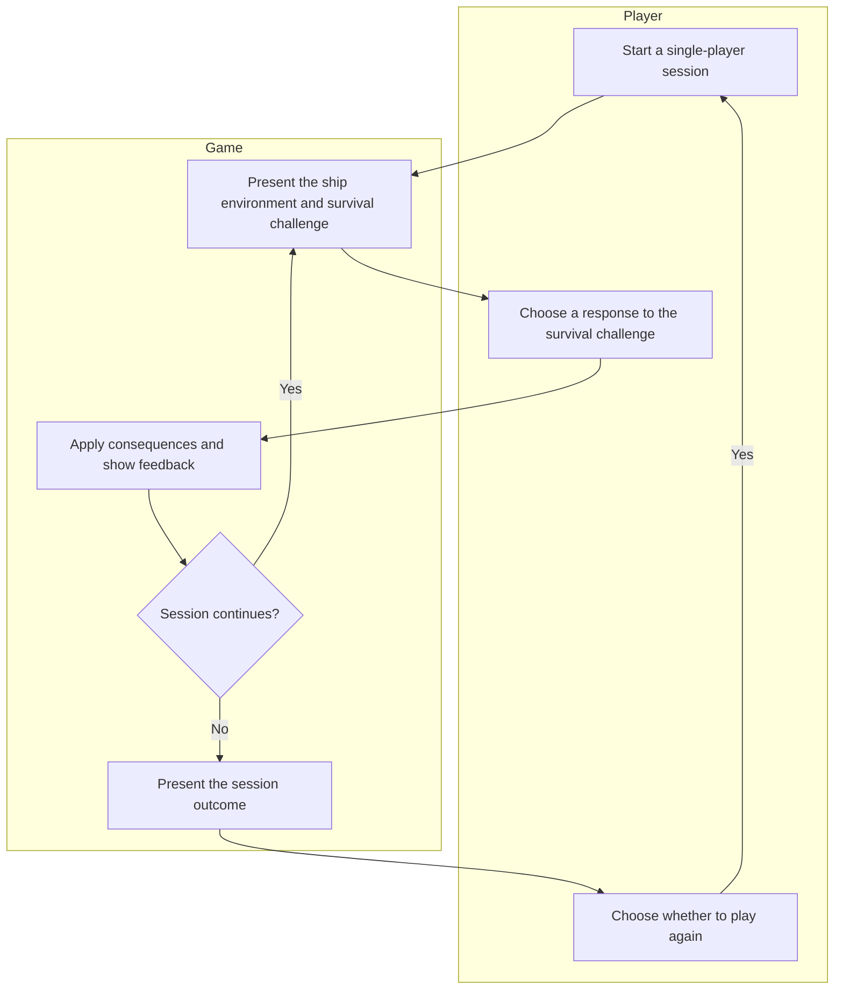
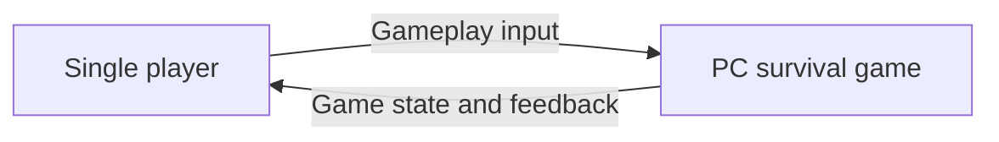

# Vision and Scope

**Project:** Working title: “Man on a Ship”  
**Team:** [13] — Shana, Whitney, Liliana, Leiton, Ivan, Gustavo  
**Client:** [Student Led]  
**Version:** 0.1 — Draft for team review  
**Source:** September 10, 2026 team meeting

This draft distinguishes decisions made during the meeting from proposals that need team approval. Mechanics, visual style, and the minimum viable product have not yet been finalized.

## Revision History

| Date | Version | Description | Author |
|---|---|---|---|
| 2026-09-11 | 0.1 | Initial draft based on September 10 meeting notes | [Author/reviewer] |

## 1. Introduction

This document establishes the purpose, direction, and boundaries of a proposed PC survival game centered on a character aboard a ship. It provides a basis for selecting features and agreeing on a manageable first release.

### 1.1 Background

The six-member project team selected the “man on a ship” concept as its direction. The team agreed to develop the single-player experience fully before beginning cooperative multiplayer, in which multiple players participate together.

The team is researching comparable games and preparing visual references to inform the game’s mechanics and style. Individual responsibilities were discussed using Ivan’s survey, but final assignments were not recorded in the meeting notes.

The client’s identity, organizational context, and expectations remain to be confirmed.

### 1.2 Current Process Flows

This is a new game concept. No existing product or player workflow was documented, so the current player experience cannot yet be modeled accurately.

The following diagram instead records the team’s current concept-development process. It should not be interpreted as an existing gameplay flow.

Team members research games and prepare proposals. The full team discusses new ideas before implementation, with decisions and meeting notes recorded in the shared Google Doc.

**Current tools and information:**

| Tool or source | Current use | Limitation or open question |
|---|---|---|
| Shared Google Doc | Meeting notes and documentation | The overall documentation structure remains undecided |
| Ivan’s survey | Discussion of interests, experience, and possible roles | Final role assignments were not recorded |
| Comparable games | Research references | Findings have not yet been consolidated |
| Miro, Pinterest, sketches | Suggested ways to present visual ideas | No required tool or format has been selected |

The immediate planning gaps are the absence of agreed starting mechanics, visual direction, and release boundaries. These are unresolved decisions; the notes do not establish measured inefficiencies in the current process.

### 1.3 References

| Reference | Date | Location |
|---|---|---|
| Team meeting notes | September 10, 2026 | Shared Google Doc; supplied notes |
| Vision and Scope template | Date not supplied | Supplied template; [course template repository](https://github.com/tcu-cosc-40943/course-templates) |
| Ivan’s team survey | Date not supplied | [Add location] |
| Don’t Sleep With the Fishes | Research pending | [Game page](https://dopplerghost.itch.io/dont-sleep-with-the-fishes) |
| Raft | Research pending | [Steam page](https://store.steampowered.com/app/648800/Raft/) |

The games listed above are research candidates. No comparison findings are asserted in this draft.

## 2. Business Requirements

### 2.1 Business Opportunity or Problem Statement

The project presents an opportunity to create a PC survival game built around life aboard a ship. The team intends to establish a complete single-player experience before considering cooperative multiplayer.

The specific player need and reason to choose this game over existing alternatives remain unvalidated. Research and early playtesting should help the team select a central gameplay experience and determine whether players find it understandable and engaging.

### 2.2 Business Objectives

The meeting did not establish quantitative business objectives. The following are **proposed product outcome objectives**, subject to approval by the team and client:

- **BO-independent-play:** At least 80% of first-time playtesters complete one agreed survival cycle without direct assistance from a developer.
- **BO-player-engagement:** At least 70% of playtesters indicate that they would voluntarily play another session after completing the prototype session.

A *survival cycle* means the recurring sequence of challenges, player actions, and consequences at the center of the game. Its content must be defined before these objectives can be tested.

### 2.3 Success Metrics

All thresholds below are proposals. No baseline measurements were supplied.

| Metric | Related objective | Indicator and source | Baseline | Proposed target and timing |
|---|---|---|---|---|
| **SM-independent-completion** | BO-independent-play | Percentage completing the agreed survival cycle without developer help, measured through observed playtests | Not measured; establish during the first prototype playtest | At least 80% by the final MVP playtest |
| **SM-repeat-interest** | BO-player-engagement | Percentage answering “yes” to whether they would voluntarily play another session, recorded in a post-playtest survey | Not measured; establish during the first prototype playtest | At least 70% by the final MVP playtest |

The team must approve the participant count, recruitment approach, test conditions, and milestone dates. Participants’ prior experience with survival games may affect results and should be recorded.

### 2.4 Vision Statement

| Element | Draft statement |
|---|---|
| **For** | PC players interested in ship-based survival |
| **Who** | Want to manage survival challenges aboard a ship |
| **The “Man on a Ship” project** | Is a PC survival game |
| **That** | Provides a complete single-player experience before expansion into cooperative play |
| **Unlike** | Alternatives to be evaluated through the team’s game research |
| **Our product** | Will emphasize a ship-centered survival experience; its distinctive advantage remains to be selected and validated |

### 2.5 Proposed Process Flows

The following is a **proposed gameplay outline**, not an approved mechanic specification. Because no existing gameplay process was supplied, it is not a before-and-after comparison with Section 1.2.

The player makes decisions, and the game communicates their consequences. The actual challenges, available actions, and conditions for ending a session remain open.

### 2.6 Risks

The following are preliminary product risks. Probability ratings are qualitative judgments requiring team review.

| Risk | Probability | Impact | Proposed mitigation |
|---|---|---|---|
| **RI-unclear-differentiation:** Players may see insufficient reason to choose this game over existing survival games | Unknown pending research | High | Identify and test one distinctive player experience |
| **RI-unengaging-survival:** Repeated survival tasks may feel tedious rather than rewarding | Unknown pending playtesting | High | Test the central survival cycle before expanding features |
| **RI-solo-role-overload:** Tasks designed around several roles may overwhelm one player | Depends on selected mechanics | High | Validate that essential tasks are manageable in solo play before adding optional assistance |
| **RI-style-expectation-mismatch:** Visual presentation may suggest a different experience from the actual gameplay | Unknown until style selection | Medium | Review visual mock-ups alongside proposed mechanics |
| **RI-unvalidated-concept:** Without a playable prototype, the team may be unable to establish whether the concept meets player needs | High if no prototype is built | High | Prioritize a small, testable gameplay experience |

### 2.7 Business Assumptions and Dependencies

| Identifier | Assumption or dependency | Consequence if false or unavailable |
|---|---|---|
| **AS-target-audience** | Players interested in ship-based survival are an appropriate target audience | The vision and feature priorities must change |
| **AS-solo-viability** | The selected concept can provide a satisfying experience for one player | Role and task mechanics must be redesigned |
| **AS-playtester-access** | Representative players will be available for feedback | Success metrics cannot be validated as planned |
| **AS-pc-access** | Intended players can access PCs that meet the eventual requirements | Hardware targets or audience expectations must be revised |

## 3. Stakeholder Profiles and User Descriptions

### 3.1 Stakeholder Profiles

| Stakeholder | Value or benefit | Attitude | Features of interest | Constraints | End user? |
|---|---|---|---|---|---|
| Project team | Deliver a coherent game and develop relevant skills | Supportive, based on concept selection | Single-player survival; possible later extensions | Capacity and responsibilities require confirmation | Potentially |
| Target PC players | An enjoyable survival experience | Unknown | Understandable and engaging gameplay | Hardware and experience vary | Yes |
| Client or project sponsor, if applicable | [Confirm expected benefit] | Unknown | [Confirm] | [Confirm] | Unknown |
| Course evaluator, if applicable | An assessable project and supporting documentation | Unknown | Demonstrable scope and outcomes | Course requirements to confirm | Usually no |

### 3.2 User Environment

The initial experience will involve one player on a PC. Cooperative multiplayer is a later possibility.

Supported operating systems, minimum hardware, controls, session length, connectivity requirements, accessibility needs, and distribution method have not been selected. No external application integrations have been identified.

### 3.3 Alternatives and Competition

| Alternative | Strengths as currently understood | Weaknesses or unanswered questions |
|---|---|---|
| Don’t Sleep With the Fishes | Selected by the team as a research reference | Team assessment pending |
| Raft | Selected by the team as a research reference | Team assessment pending |
| Status quo: players continue using existing games | Requires no adoption of this new product | Any unmet player need remains to be established |

## 4. Scope and Limitations

### 4.1 Product Perspective

The product is intended to be a PC game. Whether it requires external services has not been decided. The initial context is:

### 4.2 Major Features and Scope

| Identifier | Capability | Status |
|---|---|---|
| **FEAT-single-player-survival** | Play a survival experience centered on a character aboard a ship | Confirmed direction; mechanics undecided |
| **FEAT-npc-assistance** | Receive help with tasks or roles from non-player characters, which are characters controlled by the game | Discussed candidate |
| **FEAT-overboard-rescue** | Use a raft to rescue players or non-player characters who have fallen overboard | Discussed candidate |
| **FEAT-role-attributes** | Use character role attributes that affect survival activities | Design option under discussion |
| **FEAT-ship-stations** | Use designated ship work areas that affect survival activities | Design option under discussion |
| **FEAT-cooperative-play** | Allow multiple players to participate together | Deferred until single-player is fully developed |

Fantasy roles versus traditional survival roles remain an unresolved design choice. The team also has not decided how much influence character attributes and ship stations should have.

### 4.3 MVP Scope

The *minimum viable product (MVP)* is the smallest release that allows the team to test the intended player experience.

**Confirmed first-release direction:** FEAT-single-player-survival.

**Deferred from the initial single-player release:** FEAT-cooperative-play, consistent with the agreed development sequence.

**Not yet committed to the MVP:** FEAT-npc-assistance, FEAT-overboard-rescue, FEAT-role-attributes, and FEAT-ship-stations.

The team must define the minimum survival mechanics and what “fully developed single-player” means before this section can serve as an approved delivery commitment. The delivery date also requires confirmation.

### 4.4 Deployment Considerations

The game will target PC. The team still needs to decide:

- Supported operating systems and minimum hardware.
- How players will obtain and launch the game.
- Whether internet access is required.
- Whether saving progress is needed for the intended session length.
- How players will learn the controls and mechanics.
- Who will maintain the game after project completion.

## Open Issues for September 13, 2026, at 3:00 PM

1. Confirm the project name, team number, client, and delivery deadline.
2. Review research findings and select the target player need and distinguishing experience.
3. Define the central survival cycle and smallest playable release.
4. Decide which matters most initially: character roles, ship stations, or another mechanic.
5. Review stylistic mock-ups and discuss fantasy versus traditional survival roles.
6. Decide whether NPC assistance or overboard rescue belongs in the MVP.
7. Define completion criteria for single-player before cooperative development begins.
8. Approve or revise the proposed objectives, metrics, and playtest plan.
9. Confirm responsibilities and the documentation system, including any use of videos.

**Existing working agreements:** Keep notes and documentation in the shared Google Doc; seek input from the entire team before implementing new ideas; implement features step by step; use outside sources supplied by AI primarily as references.
